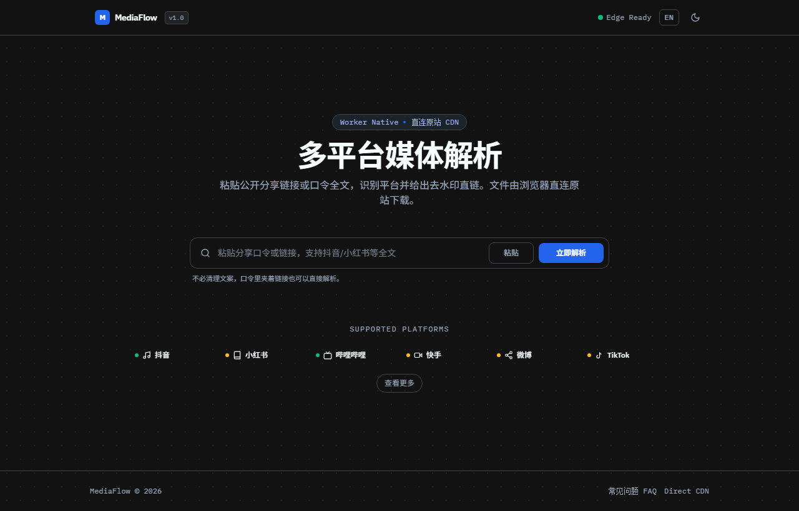
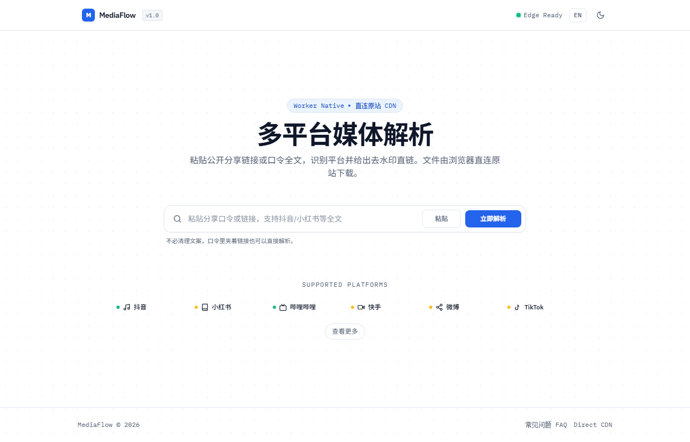

<div align="center">

# MediaFlow

**A Modern, Edge-Native Media Parsing & Direct Download Engine**

Built for Cloudflare Workers edge environment. Parses public media links and returns direct source CDN streams. Zero intermediate media proxying — downloads directly from the client.

[English](./README_EN.md) · [简体中文](./README.md) · [FAQ](./src/pages/faq.astro) · [Secrets Guide](./SECRETS.md)

<br/>



<br/>

<details>
  <summary>Toggle Light Theme Preview</summary>
  <br/>
  
</details>

</div>

---

## Architecture & Features

- **Direct CDN Streaming**: The API extracts structured metadata and temporary signed URLs from the original platform. Clients stream or download files directly from the upstream CDN, saving Worker egress costs and latency.
- **28+ Platforms Supported**: Douyin, Bilibili (WBI signature & DASH track splitting), Kuaishou, Xiaohongshu (RED), Weibo, TikTok, X (Twitter), YouTube, Instagram, and 19 additional video/audio platforms.
- **Multi-Level Resilience & Circuit Breaking**:
  - Douyin dual-path fallback (Primary API $\rightarrow$ Share Page RouterData parser);
  - International hybrid fallback (Lightweight native scrapers $\rightarrow$ Cobalt cluster pool);
  - Health score penalties and automatic circuit breaking with Half-Open self-healing probes.
- **Edge Security**: Hop-by-hop redirect verification, Private IP / intranet filtering (Anti-SSRF), sliding window rate limiting, and an unindexed hidden console with cache generation control.
- **Modern Lightweight UI**: Built with Astro static generation + Tailwind CSS. Features adaptive dark/light themes and instant zero-reload EN/ZH language switching.

---

## Supported Platforms

| Category | Platform | Strategy | Fallback Route | Credentials |
|---|---|---|---|---|
| **Domestic Core** | **Douyin** | Native (Dual-route) | Primary API $\rightarrow$ Share page RouterData | None |
| | **Bilibili** | Native (WBI sign) | DASH video/audio split $\rightarrow$ MP4 stream | None (1080P+ needs Cookie) |
| | **Xiaohongshu** | Native (State extract)| InitialState $\rightarrow$ OpenGraph meta | None (Original photos) |
| | **Kuaishou** | Native (GraphQL/HTML) | InitState $\rightarrow$ Regex pattern matching | None |
| | **Weibo** | Native (Visitor session)| Auto visitor cookie exchange $\rightarrow$ Mobile API | None (Private posts need SUB) |
| **Global Core** | **TikTok** | Native + Cobalt | WebApp parser $\rightarrow$ Cobalt endpoint | None |
| | **X (Twitter)** | Native + Cobalt | Syndication API $\rightarrow$ Cobalt endpoint | None |
| | **YouTube** | Native + Cobalt | Innertube API $\rightarrow$ Cobalt endpoint | None |
| | **Instagram** | Cobalt | Primary instance $\rightarrow$ Fallback node pool | Cobalt instance required |
| **Extended (19)** | Soda Music, Pipixia, Xigua, Weishi, Zuiyou, AcFun, Xinpianchang, etc. | Worker Native Ext. | Standalone page / public API extractors | None |

> Note: Actual availability depends on upstream platform updates. Check `GET /api/v1/platforms` for the live registered status on your node.

---

## Quick Start

### Prerequisites

- [Node.js](https://nodejs.org/) 18.0+
- [npm](https://www.npmjs.com/) 9.0+
- [Cloudflare Account](https://dash.cloudflare.com/) (Required for cloud deployment)

### Local Development

```bash
# 1. Clone repository
git clone https://github.com/rowanjove/media-flow.git
cd media-flow

# 2. Install dependencies
npm install

# 3. Run typecheck and test suite
npm run lint
npm test

# 4. Build frontend and launch edge runtime
npm run build
npm run wrangler:dev
```

Open `http://127.0.0.1:8787` in your browser.

> On Windows, simply run `start.bat` or `start.ps1`. The script checks dependencies, builds the frontend, and launches the preview server automatically.

---

## Deployment (Cloudflare Workers)

This project uses **Cloudflare Workers + Static Assets** mode, serving static frontend assets and edge APIs within a single Worker.

### 1. Authenticate with Cloudflare

```bash
npx wrangler login
```

### 2. Configure Environment & Secrets

Sensitive tokens must be injected as Workers Secrets and **never committed to Git**:

```bash
# Required: Admin console key (Missing key returns 503 on /api/v1/admin/*)
npx wrangler secret put ADMIN_SECRET

# Optional: Bilibili 1080P/4K Cookie
npx wrangler secret put BILIBILI_COOKIE

# Optional: Douyin anti-scraping Cookie
npx wrangler secret put DOUYIN_COOKIE

# Optional: Weibo enhanced session Cookie
npx wrangler secret put WEIBO_COOKIE

# Optional: Self-hosted Cobalt API Key
npx wrangler secret put COBALT_API_KEY
```

Configure non-sensitive variables in `wrangler.jsonc`:

```jsonc
{
  "vars": {
    "APP_NAME": "MediaFlow",
    "COBALT_PRIMARY_URL": "https://cobalt.yourdomain.com",
    "COBALT_FALLBACK_URLS": "https://cobalt-backup.yourdomain.com",
    "RATE_LIMIT_COUNT": "60",
    "RATE_LIMIT_WINDOW": "60"
  }
}
```

*Refer to [SECRETS.md](./SECRETS.md) for detailed extraction and configuration instructions.*

### 3. Build & Deploy

```bash
npm run build
npx wrangler deploy
```

---

## API Documentation

### Parse Media Link

- **Endpoint**: `POST /api/v1/parse`
- **Headers**: `Content-Type: application/json`
- **Body**:
  ```json
  {
    "url": "https://v.douyin.com/xxxxxx/"
  }
  ```
- **Response**:
  ```json
  {
    "success": true,
    "requestId": "9c1483ef-d2c6-4b8b-b72e-8c38fe3ef730",
    "platform": "douyin",
    "author": {
      "name": "Author Name",
      "avatar": "https://p3.douyinpic.com/..."
    },
    "content": {
      "title": "Title or description text",
      "createdAt": 1710000000000
    },
    "media": [
      {
        "type": "video",
        "url": "https://aweme.snssdk.com/aweme/v1/play/...",
        "quality": "1080p",
        "bitrate": 2500000
      }
    ],
    "source": {
      "url": "https://v.douyin.com/xxxxxx/",
      "canonicalUrl": "https://www.douyin.com/video/..."
    }
  }
  ```

### List Supported Platforms

- **Endpoint**: `GET /api/v1/platforms`
- **Response**:
  ```json
  {
    "success": true,
    "platforms": [
      {
        "id": "douyin",
        "name": "Douyin",
        "status": "stable",
        "features": { "video": true, "images": true, "audio": true }
      }
    ]
  }
  ```

---

## Hidden Admin Console

The admin entrance is deliberately hidden from the public interface:
1. Press `Ctrl + Shift + .` (`Cmd + Shift + .` on macOS) anywhere on the page, or click the brand logo 5 times;
2. Enter your configured `ADMIN_SECRET`;
3. Upon authentication, you will be redirected to `/console` to view live traffic stats, success rates, provider distributions, and invalidate the global cache generation.

---

## Privacy & Disclaimer

1. **Zero Tracking**: This project does not contain telemetry, tracking pixels, ads, or third-party analytical scripts.
2. **Credential Safety**: Authentication credentials and Cookies exist only in Cloudflare Worker runtime memory and are never exposed in responses or logs.
3. **Legal Disclaimer**: This project is intended for educational, research, and personal media backup purposes only. Always respect content creators' copyrights and platform terms of service. Do not use this tool for unauthorized bulk scraping or commercial purposes.

---

## License

This project is licensed under the [Apache-2.0 License](./LICENSE).
Third-party notices and design references are documented in [THIRD_PARTY_NOTICES.md](./THIRD_PARTY_NOTICES.md).
